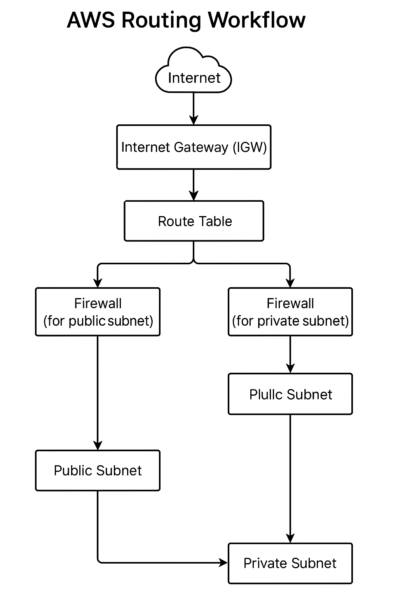

# 3.5.a In-Depth AWS Networking Resources

This section dives deep into AWS networking resources, their configurations, and packet flow examples between the internet and public/private subnets.

---

## 🔷 VPC (Virtual Private Cloud)

A VPC is an isolated virtual network within AWS that provides:

- CIDR-based IP ranges (e.g., `10.0.0.0/16`)
- Subnets (public/private)
- Internet gateways (IGWs)
- NAT Gateways
- Route Tables

**Example:**
```bash
VPC CIDR: 10.0.0.0/16
Public Subnet: 10.0.1.0/24
Private Subnet: 10.0.2.0/24
```

---

## 🔶 Subnets

Subnets logically divide a VPC into smaller segments:

- **Public Subnets**: Connected to IGW
- **Private Subnets**: Use NAT Gateway for outbound traffic

**Best Practice:** One subnet per Availability Zone (AZ)

---

## 🌐 Route Tables

Define routing behavior per subnet.

**Example Route Table (Public):**
```bash
10.0.0.0/16 → local
0.0.0.0/0   → igw-xxxxxxxx
```

---

## 🌍 Internet Gateway (IGW)

- Public internet access entry/exit point for VPC
- Must be attached to the VPC and referenced in route tables

---

## 🔁 NAT Gateway

- Allows outbound internet access for private subnets
- Requires Elastic IP
- Must reside in a public subnet

---

## 🔒 Security Groups

- Attached to EC2 instances
- **Stateful**: return traffic automatically allowed
- Only allow rules (no explicit deny)

**Example:**
```bash
Inbound:
- TCP 22 from 0.0.0.0/0
- TCP 80 from 0.0.0.0/0
```

---

## 🚧 Network ACLs (NACLs)

- Subnet-level firewalls
- **Stateless**: return traffic must be explicitly allowed
- Rules prioritized by number (lower = higher priority)

---

## 🔗 VPC Peering

- Enables direct private IP traffic between VPCs
- Non-transitive: no automatic chaining
- Requires route table updates on both ends

---

## 🧠 Transit Gateway

- Central routing hub for many VPCs and VPNs
- Reduces complexity in large environments
- Supports transitive routing

**Use Case:** Shared services across Dev/Test/Prod environments

---

## 📡 AWS Routing Workflow: Internet to Public and Private Subnets

This workflow outlines how traffic flows through AWS network components:

### 🌐 From Internet to Public Subnet

1. Client requests EC2 instance via Elastic IP (EIP)
2. EIP maps to the instance's private IP in a public subnet
3. Routed via IGW
4. Route Table: `0.0.0.0/0 → IGW`
5. Security Group rules evaluated
6. NACL (if configured) must allow the packet
7. Packet reaches the instance

### 🔒 From Internet to Private Subnet

1. Client request reaches a Load Balancer or NAT Gateway in a public subnet
2. Load Balancer forwards to target EC2 in private subnet
3. Route Table:
   - `10.0.0.0/16 → local`
   - `0.0.0.0/0 → NAT Gateway` (for egress)
4. SGs and NACLs must permit traffic
5. Response follows return path

This path includes:
- DNS/EIP Resolution
- IGW or NAT Gateway
- Load Balancer (for private target)
- Route Table evaluation
- Security and ACLs

Ideal for:
- Multi-tier apps
- Bastion-host architecture
- Hybrid network models


---



---

This concludes **3.5.a – AWS Networking In-Depth**.
